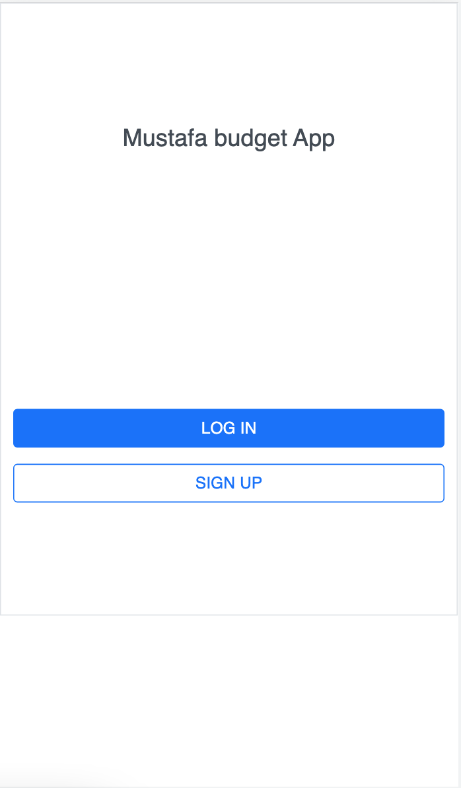
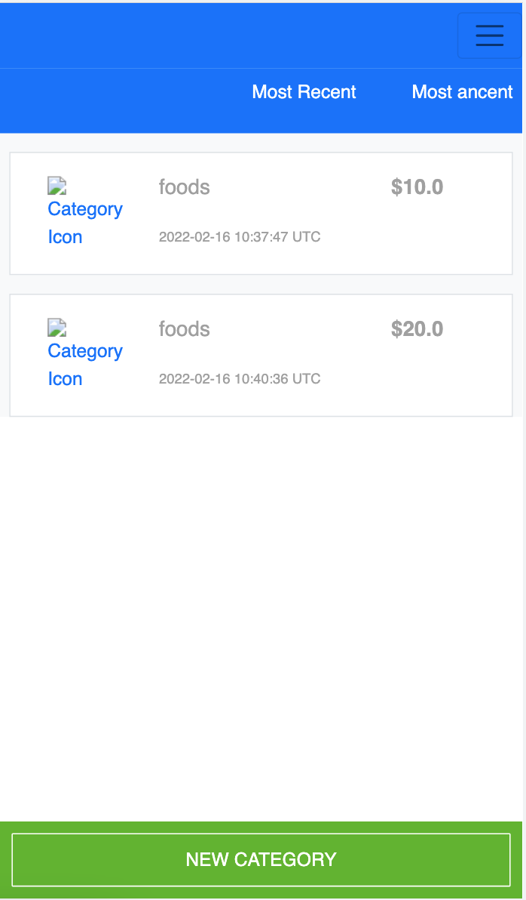

# Budget App

This project for managment budget. It was build for a Capstone Project for the Microverse Ruby on Rails module.

## Built With

-  Ruby on Rails
-  PostgreSQL

## Live Demo
[Live Demo](https://mustbudgetapp.herokuapp.com/)

## Video 
[Loom video](https://www.loom.com/share/aa32656c0c094bff814ee49ba0ef2adf)

## Screen 

## Getting Started

Download the ZIP from this [Link](https://github.com/mustabbas/budget-app.git), or run the following git command to clone the files to your machine:

- git clone https://github.com/mustabbas/budget-app.git
- Open the cloned folder on the IDE of your choice
- Install the required dependecies with `bundle install`
- run `db:migrate`
- Use `rails s `to run the program

## Author

👤 **MUSTAFA ABBAS**

- GitHub: [@githubhandle](https://github.com/mustabbas)
- LinkedIn: [LinkedIn](https://www.linkedin.com/in/mustabbas/)

## 🤝 Contributing

Contributions, issues, and feature requests are welcome!

Feel free to check the [issues page](https://github.com/mustabbas/budget-app/issues).

## Show your support

Give a ⭐️ if you like this project!

## Acknowledgments
I would like to thank the designer who design this website [ Gregoire Vella on Behance,](https://www.behance.net/gregoirevella),

## 📝 License

This project is [MIT](./MIT.md) licensed.

